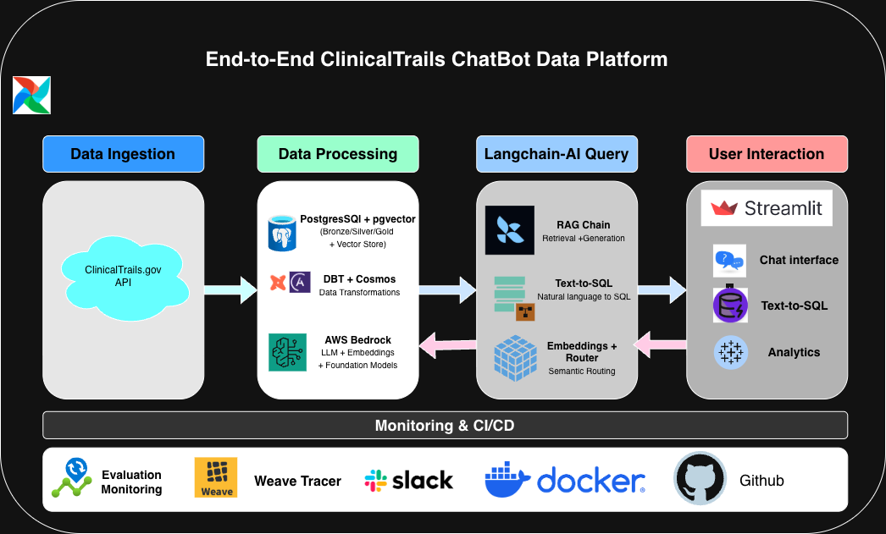
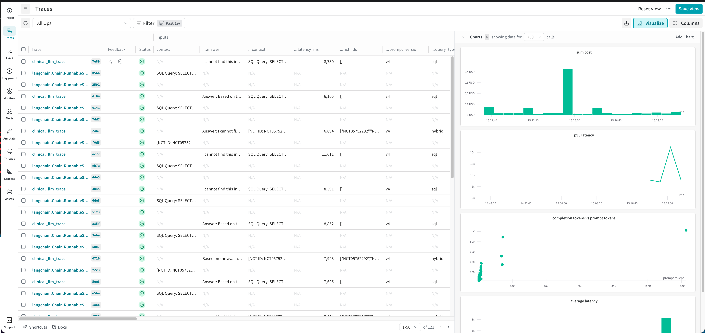
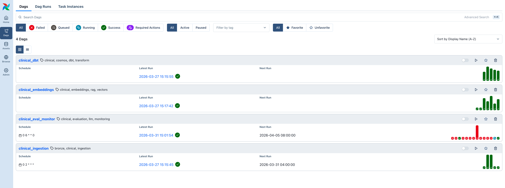
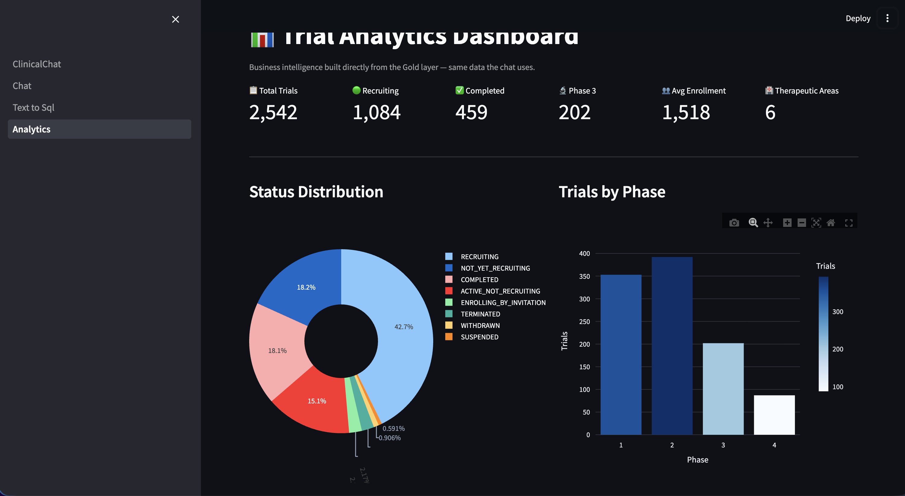

# ClinicalTrialsChatBot

> A production-grade conversational AI system that helps patients, researchers, and clinicians find and understand clinical trials — powered by RAG, vector search, and LLMs.


---

## Overview

ClinicalTrialsChatBot is an end-to-end AI application that ingests live data from [ClinicalTrials.gov](https://clinicaltrials.gov), transforms and embeds it, and exposes three conversational interfaces: a RAG-powered chat, a natural-language-to-SQL explorer, and an analytics dashboard.

The system is fully orchestrated by Apache Airflow, transformed by dbt via Astronomer Cosmos, and evaluated continuously using Weave with Slack alerting — all running in Docker with a GitHub Actions CI pipeline.

---

## Features

- **Conversational chat** — ask natural language questions, get grounded answers retrieved from clinical trial records via RAG
- **Text-to-SQL explorer** — translate plain English queries into SQL and explore structured trial data directly
- **Analytics dashboard** — visualise trial trends, phase distributions, and status breakdowns
- **Live data ingestion** — scheduled Airflow DAGs fetch and load the latest trials from ClinicalTrials.gov
- **Vector semantic search** — embeddings generated by AWS Bedrock are stored in pgvector for similarity retrieval
- **dbt-powered transformations** — raw ingested data is cleaned, typed, and modelled before serving
- **Continuous evaluation** — every pipeline run is traced with Weave, scored against a golden dataset, and alerts fire to Slack on regressions
- **Fully containerised** — one `make up` command brings up the entire stack locally

---

### Architecture



---

## Tech Stack

| Layer | Technology |
|---|---|
| **Source data** | ClinicalTrials.gov REST API |
| **Database** | PostgreSQL |
| **Vector store** | pgvector |
| **Orchestration** | Apache Airflow |
| **dbt orchestration** | Astronomer Cosmos |
| **LLM / Embeddings** | AWS Bedrock |
| **LLM framework** | LangChain |
| **Transformations** | dbt |
| **Frontend** | Streamlit |
| **Evaluation** | Weave + custom scorers + Slack alerts |
| **Containerization** | Docker / Docker Compose |
| **CI/CD** | GitHub Actions |

---

## Project Structure

```
clinical-chatbot/
├── .github/
│   └── workflows/
│       └── ci.yml                  # GitHub Actions CI pipeline
│
├── app/                            # Streamlit application
│   ├── components/
│   │   ├── chat_message.py         # Chat bubble component
│   │   ├── metrics_bar.py          # KPI metrics bar
│   │   └── source_card.py          # Source citation card
│   ├── pages/
│   │   ├── 01_chat.py              # RAG chat page
│   │   ├── 02_text_to_sql.py       # NL-to-SQL explorer
│   │   └── 03_analytics.py         # Analytics dashboard
│   └── ClinicalChat.py             # Main Streamlit entrypoint
│
├── dags/                           # Apache Airflow DAGs
│   ├── clinical_ingestion.py       # Fetch + load from ClinicalTrials.gov
│   ├── clinical_dbt.py             # Trigger dbt transformations
│   ├── clinical_embeddings.py      # Generate and store embeddings
│   └── clinical_eval_monitor.py    # Run evals + send Slack alerts
│
├── dbt_project/                    # dbt models and config
│
├── docker/
│   ├── Dockerfile.airflow
│   ├── Dockerfile.app
│   └── streamlit_config.toml
│
├── eval_datasets/
│   └── clinicalchat_eval.jsonl     # Golden evaluation dataset
│
├── src/
│   ├── db/
│   │   ├── connection.py           # PostgreSQL connection manager
│   │   └── init.sql                # Schema + pgvector setup
│   ├── evaluation/
│   │   ├── run_eval.py             # Evaluation runner
│   │   ├── scorers.py              # Custom LLM scorers
│   │   └── weave_tracer.py         # Weave trace integration
│   ├── ingestion/
│   │   ├── fetch_trials.py         # ClinicalTrials.gov API client
│   │   └── load_to_postgres.py     # Bulk load to PostgreSQL
│   ├── llm/
│   │   ├── bedrock_client.py       # AWS Bedrock wrapper
│   │   ├── router.py               # LLM query router
│   │   └── text_to_sql.py          # NL-to-SQL chain
│   ├── prompts/
│   │   ├── prompts.yml             # Prompt templates
│   │   └── prompts_registry.py     # Prompt loader
│   └── rag/
│       ├── chain.py                # LangChain RAG chain
│       ├── embeddings.py           # Embedding pipeline
│       └── retriever.py            # pgvector retriever
│
├── tests/
│   ├── test_dags.py
│   ├── test_ingestion.py
│   └── test_rag.py
│
├── docker-compose.yml
├── Makefile
├── pyproject.toml
├── requirements.txt
└── README.md
```

---
## Getting Started

### Prerequisites

- Docker and Docker Compose
- AWS credentials with Bedrock access (`AWS_ACCESS_KEY_ID`, `AWS_SECRET_ACCESS_KEY`, `AWS_DEFAULT_REGION`)
- Python 3.11+ (for local development only)

### Quick start

```bash
# Clone the repository
git clone https://github.com/saikumar1182/clinical-chatbot.git
cd clinical-chatbot

# Build and start all services
make build
make up
```
---

### Access the application

- **Web App**: http://localhost:8501
- **Airflow UI**: http://localhost:8080

---

### Environment variables

Create a `.env` file at the project root:

```env
# PostgreSQL
POSTGRES_USER=your_username
POSTGRES_PASSWORD=your_password
POSTGRES_DB=your_db
POSTGRES_HOST=your_host
POSTGRES_PORT=your_port

# AWS Bedrock
AWS_ACCESS_KEY_ID=your_key
AWS_SECRET_ACCESS_KEY=your_secret
AWS_DEFAULT_REGION=your_region
BEDROCK_MODEL_ID=your_model_id
BEDROCK_EMBED_MODEL_ID=your_embed_model_id

# Weave / Slack
WANDB_API_KEY=your_wandb_key
SLACK_WEBHOOK_URL=your_slack_webhook
```

### Useful Makefile commands

```bash
make build      # Build all Docker images
make up         # Start all services
make down       # Stop all services
make logs       # Tail logs from all containers
make test       # Run the test suite
```
---
## Data Pipeline

The data pipeline runs entirely through Apache Airflow and follows four sequential DAGs:

```
clinical_ingestion
    └── fetch_trials.py      Calls ClinicalTrials.gov API, paginates results
    └── load_to_postgres.py  Bulk-inserts raw records into PostgreSQL

clinical_dbt
    └── Triggers dbt models via Astronomer Cosmos
    └── Cleans, types, and transforms raw trials into serving tables

clinical_embeddings
    └── Reads transformed records from PostgreSQL
    └── Generates embeddings via AWS Bedrock (Titan Embed v2)
    └── Stores vectors in pgvector for similarity search

clinical_eval_monitor
    └── Runs RAG chain against clinicalchat_eval.jsonl
    └── Scores with custom Weave scorers
    └── Sends pass/fail report to Slack
```

---

## RAG Architecture

When a user sends a message in the chat interface, the following happens:

1. **Router** (`src/llm/router.py`) classifies the query — either RAG (conversational) or SQL (structured lookup)
2. **Retriever** (`src/rag/retriever.py`) embeds the query via AWS Bedrock and runs a cosine similarity search against pgvector
3. **Chain** (`src/rag/chain.py`) constructs a LangChain prompt from the retrieved trial chunks, the conversation history, and the registered prompt template
4. **Bedrock client** (`src/llm/bedrock_client.py`) calls Claude via AWS Bedrock and streams the response back to Streamlit
5. **Weave tracer** instruments every step end-to-end for observability

---

## Evaluation

The project uses [Weave](https://docs.wandb.ai/weave) for LLM observability and continuous evaluation:

- **`eval_datasets/clinicalchat_eval.jsonl`** — golden question/answer pairs covering common trial search scenarios
- **`src/evaluation/scorers.py`** — custom scorers measuring answer faithfulness, retrieval precision, and format compliance
- **`src/evaluation/run_eval.py`** — evaluation harness triggered by the `clinical_eval_monitor` DAG
- **Slack alerts** fire automatically when any scorer falls below threshold

Traces are visible in the Weave UI and AWS CloudWatch captures Bedrock inference logs for cost and latency tracking.

---

### Screenshots




---
## CI/CD

GitHub Actions runs on every push and pull request:

- Lint with `ruff`
- Type-check with `mypy`
- Run the full test suite
- Build Docker images to verify no broken dependencies

See `.github/workflows/ci.yml` for the full pipeline definition.

---

### References
- [ClinicalTrials.gov API](https://clinicaltrials.gov/data-tools/api)
- [LangChain](https://python.langchain.com/docs/)
- [AWS Bedrock](https://docs.aws.amazon.com/bedrock/latest/userguide/what-is-bedrock.html)
- [Streamlit](https://docs.streamlit.io/)
- [Apache Airflow](https://airflow.apache.org/docs/)
- [Astronomer Cosmos](https://astronomer.github.io/astronomer-cosmos/)
- [dbt](https://docs.getdbt.com/)
- [pgvector](https://github.com/pgvector/pgvector)
- [Weave](https://docs.wandb.ai/weave)

---

## Author

**Sai Kumar** · [github.com/saikumar1182](https://github.com/saikumar1182)